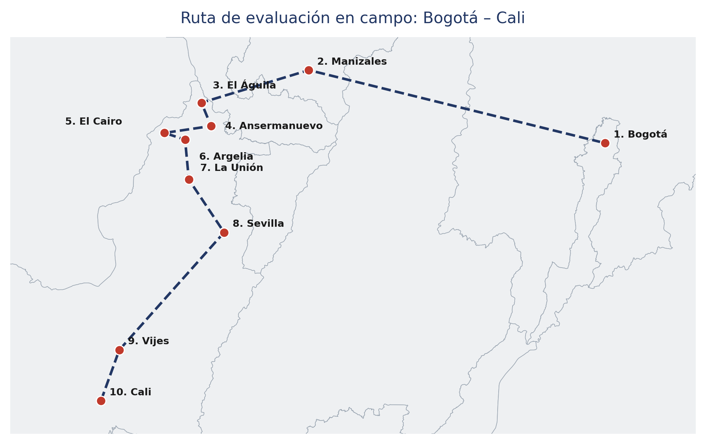

# Ruta de evaluación {.unnumbered}

Recorrido terrestre de ocho días entre Bogotá y Cali, cubriendo los municipios del norte del Valle del Cauca.

{#fig-ruta-evaluacion}

## Cronograma

- Día 1 Desplazamiento Bogotá – Manizales
- Día 1 Desplazamiento terrestre Manizales - El Águila
- Día 2 Evaluación en El Águila
- Día 2 Desplazamiento El Águila – Ansermanuevo
- Día 3 Evaluaciones en Ansermanuevo
- Día 3 Desplazamiento Ansermanuevo – El Cairo
- Día 4 Evaluaciones en El Cairo
- Día 4 Desplazamiento El Cairo – Argelia
- Día 5 Evaluaciones en Argelia
- Día 5 Desplazamiento Argelia – La Unión
- Día 6 Evaluaciones La Unión
- Día 6 Desplazamiento La Unión – Sevilla
- Día 7 Evaluaciones Sevilla
- Día 7 Desplazamiento Sevilla – Vijes
- Día 8 Evaluaciones Vijes
- Día 8 Desplazamiento Vijes – Cali
